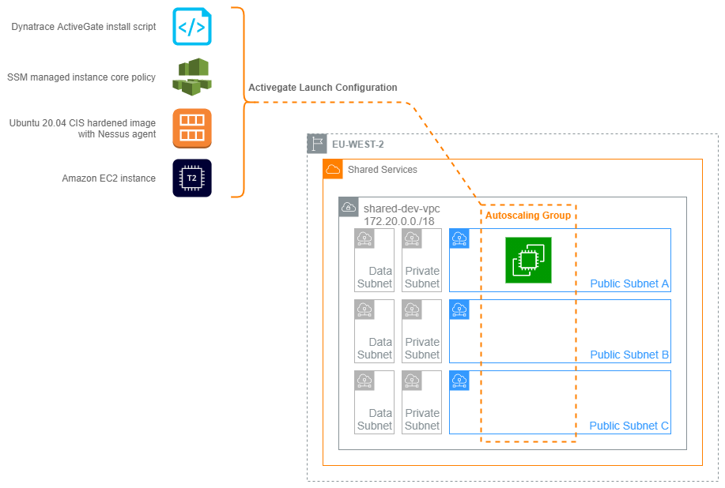

# Dynatrace Activegate



## Overview

Dynatrace is CRUK's central monitoring platform. The system employs a central cluster of servers to process data and a web of [ActiveGates](https://www.dynatrace.com/support/help/setup-and-configuration/dynatrace-activegate/basic-concepts/when-do-i-need-to-install-an-activegate/) that act like proxies, relaying data from agents back to the cluster. ActiveGates are placed in environments local to where data collection is needed. To extend Dynatrace into the new Landing Zone accounts we need to deploy new ActiveGates into the shared VPCs and ensure secure connectivity back to the cluster.

## Purpose

The purpose of this project is to automate the provision of ActiveGates as part of lifecycle management. Placing these in an autoscaling group gives us the advantage of automatic machine replacement in the case of emergencies and a platform for performing safe, controlled updates to the instances themselves.

Launching this stack into an environment will create an autoscaling group configured with an EC2 instance launch configuration. This is configured to download and install the Dynatrace Activegate server on provisioning a new instance. This in turn sets-up the instance for monitoring on a CRUK-managed, CIS hardened Ubuntu server. The instance is registered with the cluster and is configured as a new target for local Dynatrace agents. The new Activegate is also added to SSM to provide secure SSH access to the box if needed.


## Deploying the ActiveGate stack

### Configure AWS CDK local environment

After cloning the repo this AWS CDK project will need a couple of steps to become useable. The Python virtual environment will need to be initialised and updated with project libraries and dependencies.

Navigate to the root of the project and activate the virtual environment with the following command.

```bash
source .venv/bin/activate
```

All python-related paths are now pointing to the local Python environment. The app's dependencies can be installed with:

```bash
python -m pip install -r requirements.txt
```

Pre-commit hooks are included with the repo and will need initialising before you will be able to commit any changes.

```bash
pre-commit install
```

### Setting Application Parameters

A small set of parameters will need to be updated to launch this stack in to fresh environments:

**`./app.py`**

Parameter                         | Description
:----                             | :----
`vpc_id`                          | Explicitly set per environment
`account`                         | Explicitly set per environment
`region`                          | Explicitly set per environment

**`dynatrace_activegate_stack.py`**

Parameter                         | Description
:----                             | :----
`cdk.Tags.of(self).add`           | The CRUK tagging defaults are applied to every object in the stack
`sg_activegate.add_ingress_rule`  | Security Groups must allow traffic on port 9999 from all IPs in the local environment

### Locally testing commits

Pre-commit has been added to this repository and is configured to run the tests below.

Pre-commit test                 | Function
:----                           | :----
Pre-commit hooks                | A series of checks and auto-fixes for json, yaml and Python files
Black                           | 'Uncompromising' Python code formatter
Pylint                          | Python Linting and error detection

#### Using pre-commit

The test suite configured under Pre-commit will run every time a `git commit` is executed. The same tests can also be run at any time with the following command from the root directory of the project:

```bash
pre-commit run
```

Expected Output:

```bash
(.venv) ➜  dynatrace-activegate git:(CLOUD-244/cdk-local-testing-precommit) ✗ pre-commit run
Check for case conflicts.................................................Passed
Check JSON...........................................(no files to check)Skipped
Check for merge conflicts................................................Passed
Check for broken symlinks............................(no files to check)Skipped
Check Yaml...........................................(no files to check)Skipped
Fix End of Files.........................................................Passed
Trim Trailing Whitespace.................................................Passed
Mixed line ending........................................................Passed
Trim Trailing Whitespace.................................................Passed
black....................................................................Passed
pylint...................................................................Passed
```

#### Unittest

Unittest is being used to check the application templates before pushing to GitHub. This is still in development but this can be manually run by executing the following command from the root of the application directory:

```bash
python3 -m unittest test.test_unittest_dynatrace_activegate -v
```

### Launch the stack in the chosen account

Currently the `dynatrace-activegate` stack is deployed from a laptop; a deployment pipeline is planned in the very near future. The TransitVPC script creates two stacks; one in each region that the VPC peering has to bridge. Deploy these with

```bash
cdk deploy (--profile <profilename> / env. credentials) --all
```
