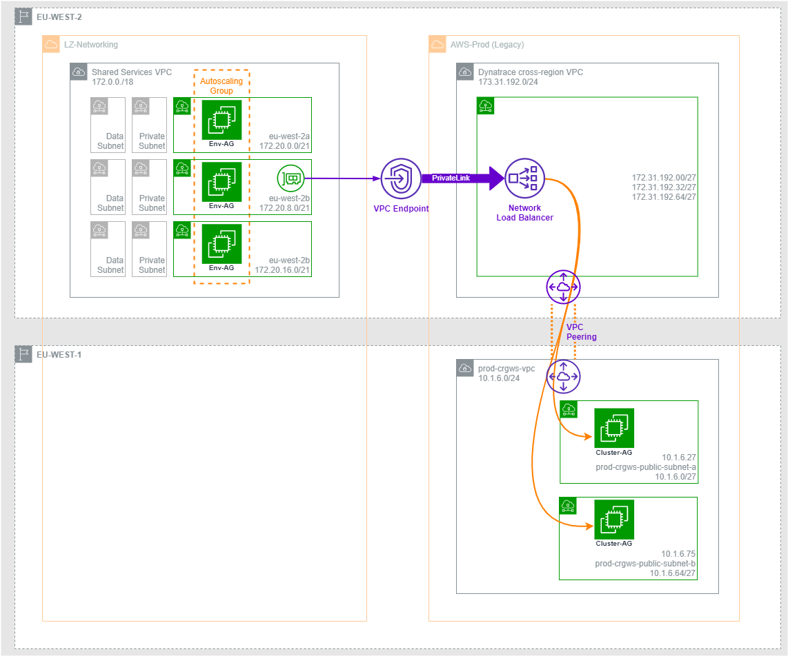

# Dynatrace Service Endpoint



## Overview

A temporary solution is needed to provide connectivity between the new AWS accounts in Landing Zone and legacy AWS accounts currently in production. This stack in conjunction with the dynatrace-endpoint stack builds a transit VPC between the two accounts and routes traffic between them over an AWS PrivateLink connection. This has a number of advantages:

* Provides a private and secure network connection between connected VPCs
* Is able to overcome private IP address range overlaps
* Can be tailored for other applications and services
* Can route traffic across region boundaries account boundaries

## Purpose

This stack is a complementary to the `dynatrace-transit-vpc` stack; it takes the Service Endpoint name from that stack and uses it to provision the PrivateLink connection in the consumer account:

1. Creates a security group for the endpoint to allow traffic from the consumer vpc
2. Adds the VPC endpoints to each availability zone
3. Takes the Service Service name and builds a set of internal Route53 records pointing the Dynatrace service to the VPC endpoints

## Deploying the Endpoint Service stack

Setting-up a new Dynatrace transit VPC requires two Stages:

1. Create a service endpoint in the service provider VPC
2. Create a VPC endpoint in the consumer VPC and connect to the endpoint service

In Landing Zone all VPC-related resources are shared from the Networking Account, so that's where we need to configure the PrivateLink connection. As the VPC is shared, resources in the network account are available to other accounts that the VPC is shared with.

The endpoint service is dependant on the `dynatrace-transit` stack for the service name. This is configured as an output from the transit stack and will look similar to `com.amazonaws.vpce.eu-west-2.vpce-svc-025328360521f0768`.

### Configure AWS CDK local environment

After cloning the repo this AWS CDK project will need a couple of steps to become useable. The Python virtual environment will need to be initialised and updated with project libraries and dependencies.

Navigate to the root of the project and activate the virtual environment with the following command.

```bash
source .venv/bin/activate
```

All python-related paths are now pointing to the local Python environment. The app's dependencies can be installed with:

```bash
python -m pip install -r requirements.txt
```

Pre-commit hooks are included with the repo and will need initialising before you will be able to commit any changes.

```bash
pre-commit install
```

### Endpoint Service Parameters

The Dynatrace endpoint service was configured using the following parameters:

#### `./script.py`

Parameter                     | Description
 :----                        | :----
**`endpoint_service_name`**   | the Service Endpoint Name outputted by the `dynatrace-transit` stack
**`peer`**                    | CIDR range allowing traffic from the service consumer VPC
**`connection`**              | The service port used by Dynatrace

### Locally testing commits

Pre-commit has been added to this repository and is configured to run the tests below.

Pre-commit test                 | Function
:----                           | :----
Pre-commit hooks                | A series of checks and auto-fixes for json, yaml and Python files
Pylint                          | Python Linting and error detection

#### Using pre-commit

The test suite configured under Pre-commit will run every time a `git commit` is executed. The same tests can also be run at any time with the following command from the root directory of the project:

```bash
pre-commit run
```

## Launch the Stack

Launch the Endpoint Service stack into the consumer account. (In our case, the shared VPC in the Networking account). The stack will create local Route53 DNS records pointed at the VPC endpoints and will output the DNS name for the newly-published Dyantrace service. It will take the form:

```yaml
vpce-04f3094497ceabca1-q634a777.vpce-svc-0c7c07b604c6f4254.eu-west-2.vpce.amazonaws.com
```

We can test if the connection is successful by performing a DNS query on the endpoint from the consumer VPC.

```bash
ubuntu@ip-172-20-18-64:~$ dig vpce-04f3094497ceabca1-q634a777.vpce-svc-0c7c07b60
4c6f4254.eu-west-2.vpce.amazonaws.com
DiG 9.16.1-Ubuntu <<>> vpce-04f3094497ceabca1-q634a777.vpce-svc-0c7c07b604c6f4254.eu-west-2.vpce.amazonaws.com
;; global options: +cmd
;; Got answer:
;; ->>HEADER<<- opcode: QUERY, status: NOERROR, id: 22195
;; flags: qr rd ra; QUERY: 1, ANSWER: 3, AUTHORITY: 0, ADDITIONAL: 1
;; OPT PSEUDOSECTION:
; EDNS: version: 0, flags:; udp: 65494
;; QUESTION SECTION:
;vpce-04f3094497ceabca1-q634a777.vpce-svc-0c7c07b604c6f4254.eu-west-2.vpce.amazonaws.com. IN A
;; ANSWER SECTION:
vpce-04f3094497ceabca1-q634a777.vpce-svc-0c7c07b604c6f4254.eu-west-2.vpce.amazonaws.com. 60 IN A 172.20.13.41  <-- !
vpce-04f3094497ceabca1-q634a777.vpce-svc-0c7c07b604c6f4254.eu-west-2.vpce.amazonaws.com. 60 IN A 172.20.61.75  <-- !
vpce-04f3094497ceabca1-q634a777.vpce-svc-0c7c07b604c6f4254.eu-west-2.vpce.amazonaws.com. 60 IN A 172.20.5.232  <-- !
;; Query time: 3 msec
;; SERVER: 127.0.0.53#53(127.0.0.53)
;; WHEN: Tue May 25 07:24:43 UTC 2021
;; MSG SIZE  rcvd: 164
```
